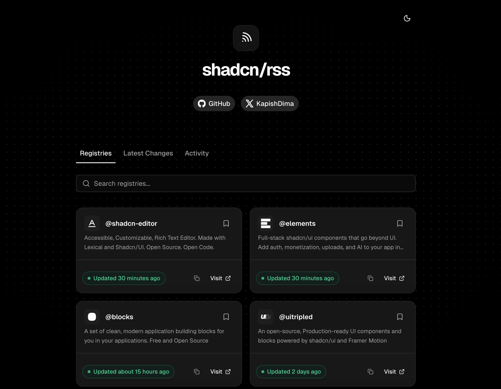

# shadcn/rss

An application that allows you to track changes in your favorite registries. Every new component or change to existing ones will be displayed here!



## Why was this created?

As the number of registries grows, it becomes increasingly difficult to track changes among such a large stream of information. This application provides a centralized place to view all changes across all registries in one location.

## Key Features

- **Registry Display**: View all registries and their last update dates
- **Change Tracking**: See a list of the latest changes for each registry
- **OPML Export**: Export data to OPML format for use in RSS readers (e.g., Feeder for Android)
- **Activity Graph**: Visualize registry activity and compare which registries release updates most frequently

## How to Add RSS to Your Registry

You need to add a route in your project that serves `rss.xml`. You can do this manually, or click the `Connect RSS feed` button next to your registry in the application and copy the provided code.

### Supported Routes

The following routes are supported:

```
/rss.xml
/feed.xml
/rss
/feed
/feed.rss
/rss.rss
/registry/rss
/registry/rss.xml
/registry/feed
/registry/feed.xml
```

### Setup Instructions (Next.js)

> **Note**: This guide assumes your registry is a Next.js application. If you're using a different stack, you can still adapt this approach to your framework.

1. **Install the package**: `pnpm add @wandry/analytics-sdk`

2. **Create the route file**: Create `/rss.xml/route.ts`

3. **Add the following code**:

```typescript
import { generateRegistryRssFeed } from "@wandry/analytics-sdk";
import type { NextRequest } from "next/server";

export const revalidate = 3600;

export async function GET(request: NextRequest) {
  const baseUrl = new URL(request.url).origin;

  const rssXml = await generateRegistryRssFeed({
    baseUrl,
    rss: {
      title: "@registry",
      description: "Subscribe to @registry updates",
      link: "https://registry.example",
      pubDateStrategy: "githubLastEdit",
    },
    github: {
      owner: "your-username",
      repo: "your-repo",
      token: process.env.GITHUB_TOKEN,
    },
  });

  if (!rssXml) {
    return new Response("RSS feed not available", {
      status: 404,
      headers: { "Content-Type": "text/plain" },
    });
  }

  return new Response(rssXml, {
    headers: {
      "Content-Type": "application/rss+xml; charset=utf-8",
      "Cache-Control":
        "public, max-age=3600, s-maxage=3600, stale-while-revalidate=86400",
    },
  });
}
```

4. **Add the GitHub Token**: Set the `GITHUB_TOKEN` environment variable (see below)

## GitHub Token

The GitHub token is **required** to correctly retrieve the date and time of the last change for each registry item. When generating `rss.xml`, a request is sent to the GitHub API to fetch the commit date for each registry item.

> **Important**: If you don't provide a GitHub token or it's incorrectly configured, all your registry items will have an update date equal to the RSS feed update date, which is not very informative.

### How to Create a GitHub Token

Navigate to **Profile → Settings → Developer Settings**

- Direct link: https://github.com/settings/personal-access-tokens

#### Classic Token

1. Go to **Tokens (classic)**

2. Click **Generate new token (classic)**

3. Select an **Expiration** period

4. Select the required **Scopes**. For everything to work correctly, you need to select:
   - `repo:status`
   - `public_repo`

#### Fine-Grained Token

1. Go to **Fine-grained tokens**

2. Click **Generate new token**

3. Configure the token:

   - **Token name**: Enter a descriptive name
   - **Expiration**: Select an expiration period
   - **Repository access**: Select the repository you want to access

4. Click **Add permissions**, set the following:
   - **Content**: Read-only access

> **Note**: Fine-grained tokens provide more granular control and are recommended for new integrations. The **Contents** permission with read-only access is sufficient to retrieve commit information for registry items.

## Link Formation

Since each registry may have its own documentation structure, the RSS generator cannot know exactly which link to use for a registry item. Therefore, three options are provided for link formation:

### 1. Path String

Using a simple path string:

```typescript
blocksUrl: "/docs/blocks";
```

This generates a link like: `https://registry.example/docs/blocks/registry-item`

### 2. Function with Item Name

Using a function that receives the registry item name as an argument:

```typescript
blocksUrl: ((itemName) => {
  return `blocks/auth/${itemName}`;
}) as UrlResolverByName;
```

This generates a link like: `https://registry.example/blocks/auth/registry-item`

### 3. Function with Full Item Object

Using a function that receives the complete registry item as an argument:

```typescript
blocksUrl: ((item) => {
  const category = item.categories.at(0);
  const name = item.name;

  return `blocks/${category}/${name}`;
}) as UrlResolverByItem;
```

This generates a link like: `https://registry.example/blocks/auth/registry-item`

## What if Your Registry is Not in the List?

The list of registries is sourced from the [shadcn directory](https://ui.shadcn.com/docs/directory). If your registry is not listed there, you can reach out via DM on [X (Twitter)](https://x.com/kapish_dima) and I'll add it manually.
